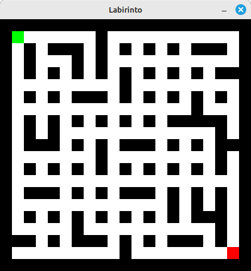
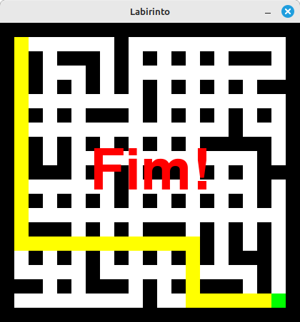

# Labirinto com Pygame

Este projeto é um jogo de labirinto desenvolvido em Python utilizando a biblioteca **pygame**. O jogador controla um ponto verde que deve chegar ao ponto final vermelho. Ao completar o labirinto, o caminho percorrido é destacado em amarelo, e uma mensagem "Fim!" é exibida na tela.

Feito com o ChatGPT, just for fun.

---

## 📋 Requisitos

Antes de começar, certifique-se de ter as seguintes dependências instaladas:

### Dependências do Python
- Python 3.8 ou superior
- Biblioteca **pygame**

### Instalação do `pygame`
Você pode instalar o pygame utilizando o pip:
```bash
pip install pygame
```

---

## 🚀 Como Executar

1. Clone ou baixe o repositório contendo o código-fonte.
2. Certifique-se de que o Python e o pygame estão instalados.
3. No terminal, navegue até o diretório do projeto e execute o seguinte comando:

   ```bash
   python nome_do_arquivo.py
   ```

---

## 🎮 Instruções do Jogo

### Controles:
- **Setas do Teclado**: Movem o jogador (ponto verde) pelo labirinto.
- **Tecla `ESC` ou `q`**: Sai do jogo.
- **Tecla `r` ou `R`**: Reinicia o jogo com um novo labirinto.

### Objetivo:

- Navegue pelo labirinto começando no ponto verde até alcançar o ponto final (vermelho).
- Ao completar o labirinto:
  - O caminho percorrido será destacado em **amarelo**.
  - A mensagem **"Fim!"** será exibida no centro da tela.

### Observação:

- O ponto inicial desaparece assim que você começa a se mover.

---

## 🧩 Geração do Labirinto

O labirinto é gerado utilizando algoritmos diferentes para padrões variados, incluindo:

- **Prim's randomized maze generation**: Gera labirintos simplórios.
- **Recursive Backtracking**: Gera labirintos mais intrincados e densos.
- **Kruskal's Algorithm**: Produz labirintos mais simétricos e abertos.

Para alternar entre os algoritmos, utilize a versão correspondente do script.

---

## 🛠️ Personalizações

- **Dimensão do Labirinto**: Altere a largura e altura do labirinto ajustando as variáveis `width` e `height` no código.
- **Tamanho das Células**: Modifique o valor de `cell_size` para ajustar o tamanho gráfico das células.

---

## 🖥️ Capturas de Tela

- **Inicio do Jogo**: Ponto verde no ponto inicial e ponto vermelho como destino.



- **Fim do Jogo**: Caminho percorrido destacado e mensagem centralizada.



---

## 📄 Licença

Este projeto é livre para uso educacional e pessoal. Modifique conforme necessário e divirta-se aprendendo!

---
